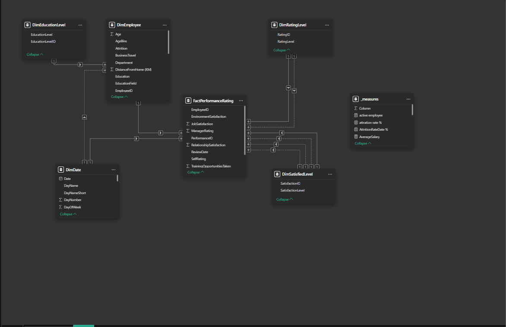
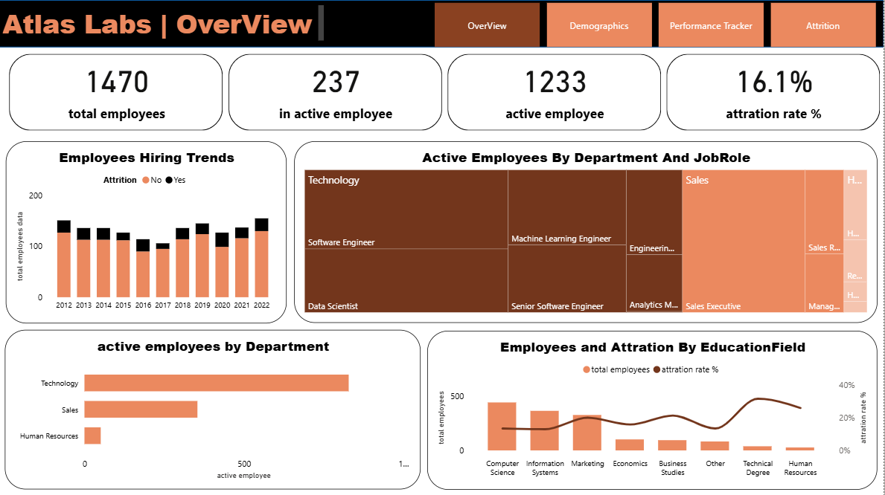
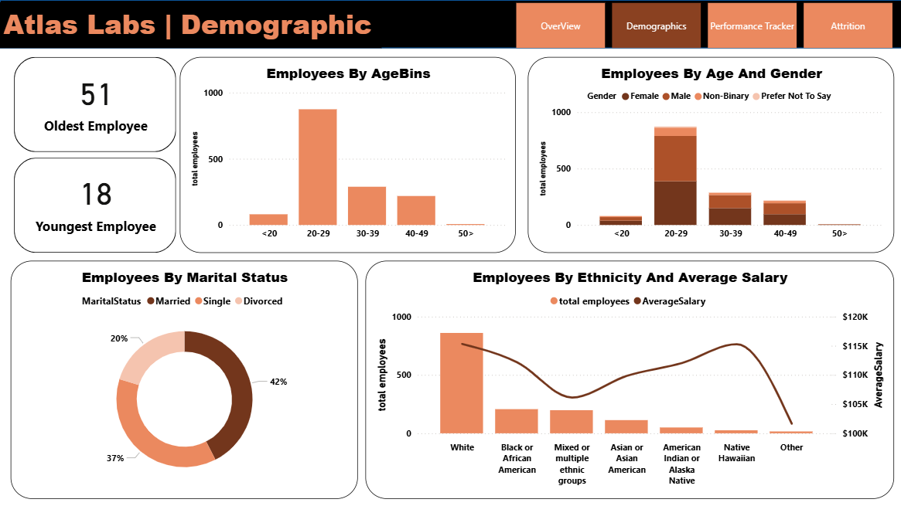
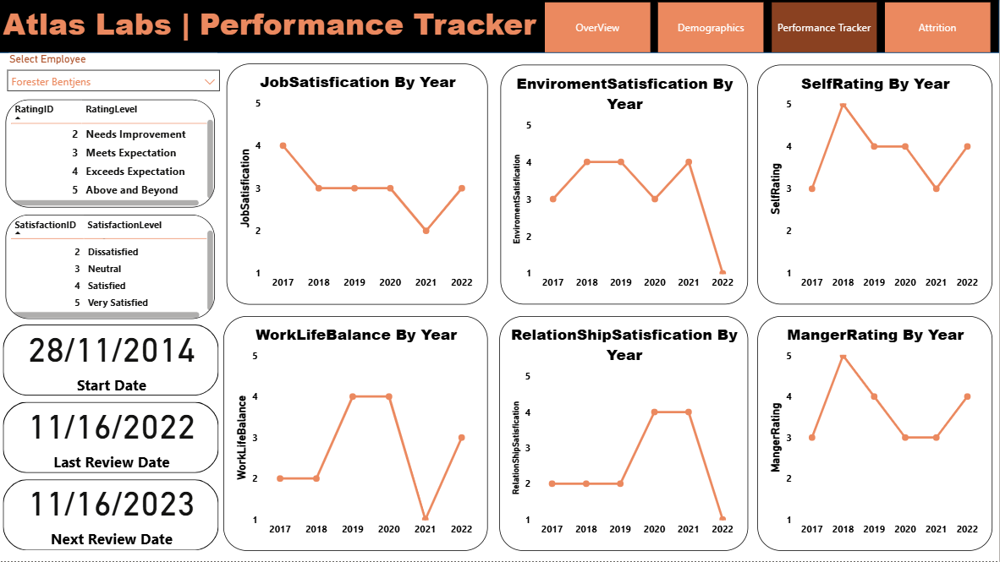
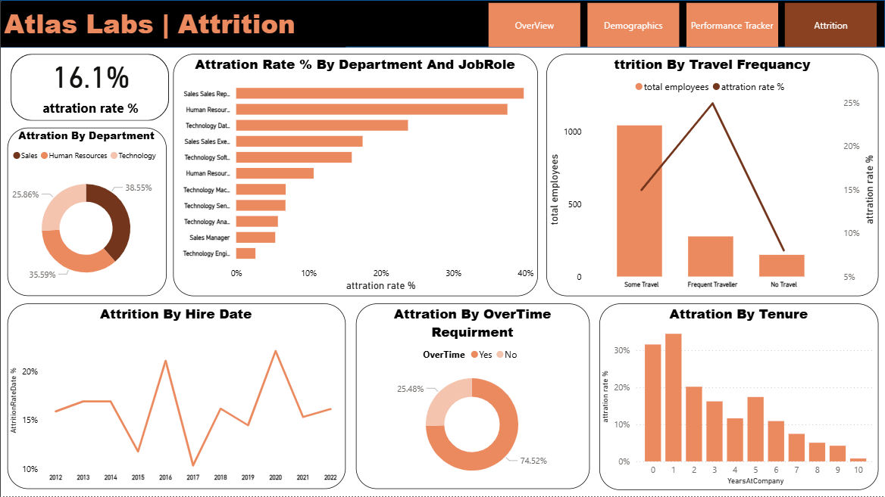

# Atlas Labs | HR Analytics Dashboard

## 📊 Project Overview
This repository contains the source files for the **Atlas Labs HR Analytics Dashboard**, a comprehensive data visualization project designed to monitor key Human Resources metrics, specifically focusing on **employee attrition, demographics, and performance tracking**.

The dashboard provides a deep-dive into the workforce data, enabling HR professionals and management to make data-driven decisions to improve employee retention, satisfaction, and overall performance.

## 🎯 Key Goals
* **Monitor Attrition:** Identify and analyze the primary drivers of employee turnover across departments, job roles, travel frequency, and tenure.
* **Understand Workforce Composition:** Provide a clear view of the demographic makeup of Atlas Labs employees (age, gender, marital status, ethnicity).
* **Track Employee Performance:** Evaluate individual and collective performance, satisfaction levels (Job, Environment, Relationship), and work-life balance over time.
* **Identify High-Risk Areas:** Pinpoint specific job roles, departments, or demographics with unusually high attrition rates for targeted interventions.

---

## 🔑 Key Insights & Metrics
The dashboard is structured into four main sections, each providing specific insights:

### 1. Overview
| Metric | Value | Description |
| :--- | :--- | :--- |
| **Total Employees** | 1470 | The total number of employees in the dataset. |
| **Active Employees** | 1233 | The number of employees currently employed. |
| **Attrition Rate** | **16.1%** | The overall percentage of employees who have left the company. |
| **Hiring Trends** | *Variable* | Tracks the number of new hires year-over-year (2012-2022). |
| **Attrition by Education** | *Variable* | Shows attrition percentage broken down by Education Field. |

### 2. Attrition Deep Dive
* **Top Attrition Job Roles:** Sales Representatives, Human Resources, and Technology Data Scientists show the highest attrition rates.
* **Travel Frequency:** **Frequent Travelers** have the highest attrition rate, significantly higher than those who rarely or never travel.
* **Overtime Requirement:** Employees required to work **Overtime (Yes)** have a significantly higher attrition rate (approx. **25.5%**) compared to those without overtime (approx. **74.5%** of attrited employees).
* **Tenure Risk:** The highest attrition occurs within the first **0-2 years** of employment, peaking between 1 and 2 years.

### 3. Demographics
* **Age Range:** Employees range from **18 (Youngest)** to **51 (Oldest)**. The largest segment of employees is in the **20-29** age bin.
* **Marital Status:** The workforce is predominantly **Married (42%)** and **Single (37%)**.
* **Ethnicity & Salary:** Provides a comparison of total employees and **Average Salary** across different ethnic groups.

### 4. Performance Tracker (Employee-Specific)
This section allows for an in-depth view of an individual employee's history (e.g., Forester Bentjens's data shown):
* **Satisfaction Tracking:** Tracks yearly scores for **Job Satisfaction**, **Environment Satisfaction**, and **Relationship Satisfaction**.
* **Rating Evolution:** Monitors **Self-Rating** and **Manager Rating** evolution over time.
* **Work-Life Balance:** Tracks the yearly score for the **Work-Life Balance** metric.

---
## 🏗️ Data Model (Snowflake Schema)

The dashboard is built upon a **Snowflake Schema** data model, designed for optimal analysis of employee performance and demographics. This structure helps separate descriptive attributes from factual, measured events, ensuring efficiency and clarity in the data structure.

### Model Components:

#### 1. Fact Table
* **FactPerformanceRating:** The central table containing key metrics and foreign keys. It records performance events and satisfaction scores, including **Job Satisfaction**, **Environment Satisfaction**, **Manager Rating**, **Self Rating**, and **Training Opportunities Taken**.

#### 2. Dimension Tables
* **DimEmployee:** Contains static employee attributes like **Age**, **Gender**, **Attrition**, **Department**, and **Education Field**.
* **DimDate:** A standard date dimension used for filtering and time-based analysis (e.g., **ReviewDate**).
* **DimEducationLevel:** A snowflaked dimension that provides the specific **Education** details linked by **EducationLevelID**.
* **DimRatingID:** A snowflaked dimension defining the specific **RatingLevel** (e.g., Unacceptable, Meets Expectation).
* **DimSatisfactionLevel:** A snowflaked dimension defining the specific **Satisfaction Level** (e.g., Very Dissatisfied, Satisfied).

#### 3. Measures Table
* **_measures:** A virtual table (or measure group) containing calculated KPIs such as **total employees**, **active employee**, **attrition rate %**, **AttritionDateRate %**, and **AverageSalary**.

### Schema Visualisation
For a visual representation of the relationships between these tables:

---

## 🛠️ Technology Stack
The dashboards were created using a modern Business Intelligence tool.
* **Tool:** Power BI / Tableau (or similar BI platform)
* **Data Source:** Likely an internal HR database (e.g., SQL, Excel, or CSV files).

---

## 📁 Source Code & Files
The core source code files for this dashboard project typically include:
* `Atlas_Labs_Overview.pbix` (or similar file extension for the BI tool)
* `Atlas_Labs_Demographic.pbix`
* `Atlas_Labs_Performance_Tracker.pbix`
* `Atlas_Labs_Attrition.pbix`
* `HR_Data_Source.csv` (or `.xlsx`) - *The underlying dataset used to generate the visuals.*

**Note:** The visualization files (`.pbix`, `.twb`, etc.) require the corresponding BI software to be viewed and edited.
# Atlas Labs | HR Analytics Dashboard

---
## 📸 Dashboard Screenshots

---
### 1. Overview

---
### 2. Demographics

---
### 3. Performance Tracker

---
### 4. Attrition

---

## 🤝 Contribution
Contributions, issues, and feature requests are welcome! Feel free to check the (https://github.com/mohammedsarahan4085-bit/Atlas-Labs-HR-Analytics/issues).

---
